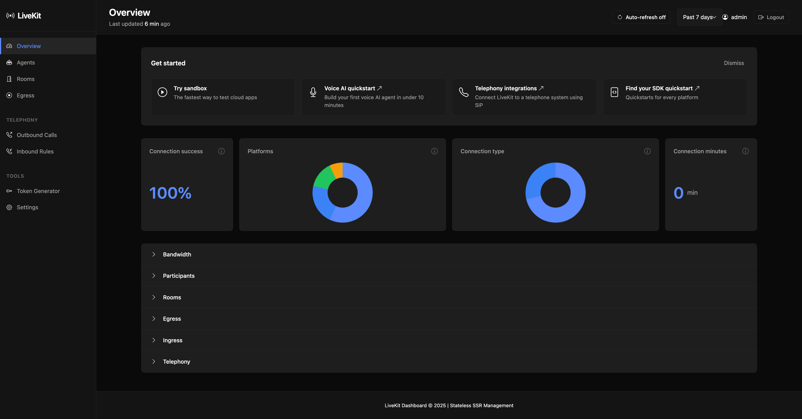

# LiveKit Dashboard

A **stateless**, self-hosted, server-side rendered (SSR) dashboard for managing a private [LiveKit](https://livekit.io) server. Built with **FastAPI** and **Jinja2** templates, using only the LiveKit Python SDK for real-time server management.


## ✨ Features



- 🎯 **Stateless Architecture** - No database, no Redis, no background workers
- 🔐 **Simple Authentication** - HTTP Basic Auth with one admin account
- 📊 **Comprehensive Analytics** - Real-time analytics for all LiveKit services
- 🏠 **Overview Dashboard** - Server status, active rooms, participants count, SDK latency
- 🚪 **Room Management** - List, create, close rooms; view participants and tracks
- 🎫 **Token Generation** - Generate join tokens on-the-fly for testing
- 👥 **Participant Control** - Kick participants, view tracks, connection stats
- 📹 **Egress/Recordings** - Start/stop composite egress, view active jobs
- 📥 **Ingress Monitoring** - Stream analytics and connection quality metrics
- 📞 **SIP Integration** - (Optional) Manage SIP trunks, outbound/inbound calls
- 🔧 **Settings View** - Read-only configuration and server info
- 🧪 **Sandbox** - Token generator with HMAC verification helper

## 📊 Analytics Dashboard

### Real-time Analytics

- **Connection Success Rate** - Based on room health and participant status
- **Platform Distribution** - Web, iOS, Android, React Native client detection
- **Connection Types** - WebRTC Direct vs TURN Relay analysis
- **Session Duration** - Live calculation from participant join times

### Service-Specific Analytics

- **Room Analytics** - Active rooms, participant distribution, room sizes
- **Egress Analytics** - Job status, success rates, storage usage, type distribution
- **Ingress Analytics** - Stream monitoring, connection quality, bitrate analysis
- **SIP Analytics** - Trunk status, call volume, dispatch rules (when enabled)

### Visual Components

- **Interactive Charts** - Chart.js doughnut charts for data distribution
- **Responsive Design** - Mobile-friendly analytics cards
- **Real-time Updates** - Live data from LiveKit APIs
- **Error Handling** - Graceful fallbacks and debug information

## 🏗️ Architecture

```
┌─────────────────────────────────────────────────────┐
│                    User Browser                     │
│              (HTTP Basic Auth)                      │
└────────────────────┬────────────────────────────────┘
                     │ HTTPS
                     ▼
┌─────────────────────────────────────────────────────┐
│           FastAPI + Jinja2 (SSR)                    │
│  ┌─────────────────────────────────────────────┐   │
│  │  Routes: Overview, Rooms, Egress, SIP...    │   │
│  └─────────────────┬───────────────────────────┘   │
│                    │                                 │
│  ┌─────────────────▼───────────────────────────┐   │
│  │      LiveKitClient (SDK Wrapper)            │   │
│  └─────────────────┬───────────────────────────┘   │
└────────────────────┼────────────────────────────────┘
                     │ SDK API Calls
                     ▼
┌─────────────────────────────────────────────────────┐
│              LiveKit Server                         │
│         (Your Private Deployment)                   │
└─────────────────────────────────────────────────────┘
```

### Key Principles

- **Stateless**: All data is fetched directly from LiveKit on each request
- **SSR**: Server-side rendered HTML with Jinja2 templates
- **Progressive Enhancement**: HTMX for auto-refresh and better UX
- **Secure**: HTTP Basic Auth, CSRF protection, security headers
- **Minimal**: No external dependencies beyond FastAPI and LiveKit SDK

## 🚀 Quick Start

### Prerequisites

- Python 3.10 or higher
- A running LiveKit server instance
- LiveKit API key and secret

### Option 1: Using Poetry (Recommended)

```bash
# Clone the repository
git clone <repository-url>
cd livekit-dashboard

# Install dependencies
make install

# Create and configure .env file
make env-example

# Edit .env with your LiveKit credentials
nano .env

# Run in development mode
make dev
```

### Option 2: Using Docker

```bash
# Clone the repository
git clone <repository-url>
cd livekit-dashboard

# Create .env file
cp .env.example .env

# Edit .env with your credentials
nano .env

# Build and run with Docker Compose
make docker-run

# Or manually:
docker-compose up -d
```

### Option 3: Manual Setup

```bash
# Install Poetry
curl -sSL https://install.python-poetry.org | python3 -

# Install dependencies
poetry install

# Set environment variables
export LIVEKIT_URL="https://your-livekit-server.com"
export LIVEKIT_API_KEY="your-api-key"
export LIVEKIT_API_SECRET="your-api-secret"
export ADMIN_USERNAME="admin"
export ADMIN_PASSWORD="secure-password"
export APP_SECRET_KEY="$(openssl rand -hex 32)"

# Run the application
poetry run uvicorn app.main:app --host 0.0.0.0 --port 8000
```

## 🔧 Configuration

All configuration is done via environment variables. Create a `.env` file:

```bash
# LiveKit Server Configuration
LIVEKIT_URL=https://your-livekit-server.com
LIVEKIT_API_KEY=your-api-key
LIVEKIT_API_SECRET=your-api-secret

# Admin Authentication
ADMIN_USERNAME=admin
ADMIN_PASSWORD=changeme

# Application Settings
APP_SECRET_KEY=your-secret-key-for-csrf-and-sessions
DEBUG=false
HOST=0.0.0.0
PORT=8000

# Feature Flags
ENABLE_SIP=false
```

### Environment Variables

| Variable             | Required | Default    | Description                                                       |
| -------------------- | -------- | ---------- | ----------------------------------------------------------------- |
| `LIVEKIT_URL`        | ✅       | -          | LiveKit server URL (e.g., `https://your-server.com`)              |
| `LIVEKIT_API_KEY`    | ✅       | -          | LiveKit API key                                                   |
| `LIVEKIT_API_SECRET` | ✅       | -          | LiveKit API secret                                                |
| `ADMIN_USERNAME`     | ✅       | `admin`    | Dashboard admin username                                          |
| `ADMIN_PASSWORD`     | ✅       | `changeme` | Dashboard admin password                                          |
| `APP_SECRET_KEY`     | ✅       | -          | Secret key for CSRF tokens (generate with `openssl rand -hex 32`) |
| `DEBUG`              | ❌       | `false`    | Enable debug mode                                                 |
| `HOST`               | ❌       | `0.0.0.0`  | Host to bind to                                                   |
| `PORT`               | ❌       | `8000`     | Port to listen on                                                 |
| `ENABLE_SIP`         | ❌       | `false`    | Enable SIP features                                               |

## 📖 Usage

### Accessing the Dashboard

1. Open your browser and navigate to `http://localhost:8000`
2. Enter your admin credentials when prompted
3. You'll see the overview dashboard with server stats

### Main Features

#### Overview Page (`/`)

- View server status and health
- See total rooms and participants
- Monitor SDK latency
- Quick access to recent rooms

#### Rooms (`/rooms`)

- List all active rooms
- Create new rooms with custom settings
- View room details and participants
- Close/delete rooms
- Generate join tokens for participants

#### Egress (`/egress`)

- List active egress jobs
- Start room composite recordings
- Stop active recordings
- View file outputs and download URLs

#### SIP (`/sip-outbound`, `/sip-inbound`)

- View configured SIP trunks
- Create outbound SIP calls
- View inbound dispatch rules

#### Token Generator (`/sandbox`)

- Generate test tokens for development
- Customize permissions and TTL
- Copy tokens to clipboard
- Quick links to test apps

#### Settings (`/settings`)

- View server configuration
- Check connection status
- Review security settings
- See feature flags

## 🛠️ Development

### Available Commands

```bash
make help          # Show all available commands
make install       # Install dependencies
make dev           # Run in development mode with auto-reload
make run           # Run in production mode
make test          # Run tests
make test-cov      # Run tests with coverage report
make fmt           # Format code with Black
make lint          # Lint code with Ruff and mypy
make clean         # Clean up cache and temporary files
make docker-build  # Build Docker image
make docker-run    # Run with Docker Compose
make docker-stop   # Stop Docker services
make docker-logs   # View Docker logs
```

### Project Structure

```
livekit-dashboard/
├── app/
│   ├── main.py                 # FastAPI application entry point
│   ├── routes/                 # Route handlers
│   │   ├── overview.py         # Overview/dashboard
│   │   ├── rooms.py            # Room management
│   │   ├── egress.py           # Egress/recordings
│   │   ├── sip.py              # SIP telephony
│   │   ├── settings.py         # Settings page
│   │   ├── sandbox.py          # Token generator
│   │   └── auth.py             # Authentication
│   ├── services/               # Business logic
│   │   └── livekit.py          # LiveKit SDK wrapper
│   ├── security/               # Security modules
│   │   ├── basic_auth.py       # HTTP Basic Auth
│   │   └── csrf.py             # CSRF protection
│   ├── templates/              # Jinja2 templates
│   │   ├── base.html.j2        # Base template
│   │   ├── index.html.j2       # Overview page
│   │   ├── rooms/              # Room templates
│   │   ├── egress/             # Egress templates
│   │   ├── sip/                # SIP templates
│   │   ├── settings.html.j2    # Settings page
│   │   └── sandbox.html.j2     # Token generator
│   └── static/                 # Static assets
│       ├── css/                # Stylesheets
│       └── js/                 # JavaScript
├── Dockerfile                  # Docker image definition
├── docker-compose.yml          # Docker Compose configuration
├── pyproject.toml              # Python dependencies
├── Makefile                    # Development commands
└── README.md                   # This file
```

## 🔒 Security

### Best Practices

1. **Always use HTTPS in production**

   - Configure a reverse proxy (nginx, Caddy) with TLS
   - Update security headers accordingly

2. **Change default credentials**

   ```bash
   export ADMIN_USERNAME="your-admin-user"
   export ADMIN_PASSWORD="$(openssl rand -base64 32)"
   ```

3. **Generate a strong secret key**

   ```bash
   export APP_SECRET_KEY="$(openssl rand -hex 32)"
   ```

4. **Keep LiveKit credentials secure**

   - Never commit `.env` files
   - Use environment variable injection in production
   - Rotate API keys regularly

5. **Enable security headers**

   - HSTS, CSP, X-Frame-Options (enabled by default)
   - Adjust Content-Security-Policy for your needs

6. **Rate limiting** (optional)
   - Consider adding rate limiting middleware
   - Use a reverse proxy with rate limiting

### Security Headers

The application automatically sets these security headers:

- `X-Content-Type-Options: nosniff`
- `X-Frame-Options: DENY`
- `X-XSS-Protection: 1; mode=block`
- `Referrer-Policy: strict-origin-when-cross-origin`
- `Strict-Transport-Security` (in production)
- `Content-Security-Policy` (restrictive by default)

## 🐳 Docker Deployment

### Production Deployment with Docker

```bash
# 1. Build the image
docker build -t livekit-dashboard:latest .

# 2. Run with environment variables
docker run -d \
  --name livekit-dashboard \
  -p 8000:8000 \
  -e LIVEKIT_URL="https://your-server.com" \
  -e LIVEKIT_API_KEY="your-key" \
  -e LIVEKIT_API_SECRET="your-secret" \
  -e ADMIN_USERNAME="admin" \
  -e ADMIN_PASSWORD="secure-password" \
  -e APP_SECRET_KEY="$(openssl rand -hex 32)" \
  livekit-dashboard:latest
```

### Docker Compose

```bash
# Start services
docker-compose up -d

# View logs
docker-compose logs -f

# Stop services
docker-compose down
```

## 🧪 Testing

```bash
# Run all tests
make test

# Run with coverage
make test-cov

# Run linting
make lint

# Run formatting
make fmt

# Run all checks
make check
```

## 📝 API Endpoints

| Endpoint               | Method | Description        | Auth Required |
| ---------------------- | ------ | ------------------ | ------------- |
| `/`                    | GET    | Overview dashboard | ✅            |
| `/rooms`               | GET    | List rooms         | ✅            |
| `/rooms`               | POST   | Create room        | ✅            |
| `/rooms/{name}`        | GET    | Room details       | ✅            |
| `/rooms/{name}/delete` | POST   | Delete room        | ✅            |
| `/rooms/{name}/token`  | POST   | Generate token     | ✅            |
| `/egress`              | GET    | List egress jobs   | ✅            |
| `/egress/start`        | POST   | Start egress       | ✅            |
| `/egress/{id}/stop`    | POST   | Stop egress        | ✅            |
| `/sip-outbound`        | GET    | SIP outbound page  | ✅            |
| `/sip-inbound`         | GET    | SIP inbound page   | ✅            |
| `/sandbox`             | GET    | Token generator    | ✅            |
| `/settings`            | GET    | Settings page      | ✅            |
| `/logout`              | GET    | Logout page        | ❌            |
| `/health`              | GET    | Health check       | ❌            |

## 🤝 Contributing

Contributions are welcome! Please follow these guidelines:

1. Fork the repository
2. Create a feature branch (`git checkout -b feature/amazing-feature`)
3. Commit your changes (`git commit -m 'Add amazing feature'`)
4. Push to the branch (`git push origin feature/amazing-feature`)
5. Open a Pull Request

### Code Style

- Use **Black** for Python formatting: `make fmt`
- Use **Ruff** for linting: `make lint`
- Follow existing patterns and conventions
- Add tests for new features

## 📄 License

This project is licensed under the MIT License - see the LICENSE file for details.

## 🙏 Acknowledgments

- [LiveKit](https://livekit.io) - Open source WebRTC infrastructure
- [FastAPI](https://fastapi.tiangolo.com) - Modern Python web framework
- [Bootstrap](https://getbootstrap.com) - UI framework
- [HTMX](https://htmx.org) - Progressive enhancement library

## 📞 Support

- Documentation: [LiveKit Docs](https://docs.livekit.io)
- Issues: [GitHub Issues](https://github.com/your-repo/issues)
- Community: [LiveKit Discord](https://livekit.io/discord)

## 🗺️ Roadmap

- [ ] WebSocket live updates
- [ ] Advanced participant management
- [ ] Recording download management
- [ ] Multi-user support with roles
- [ ] Ingress management
- [ ] Analytics and metrics
- [ ] Dark mode theme
- [ ] Mobile-responsive improvements

## ✅ Definition of Done

- ✅ App is stateless: no DB/Redis/background workers
- ✅ All data fetched directly from LiveKit per request
- ✅ HTTP Basic Auth using one admin account from env
- ✅ All routes protected except `/health` and `/logout`
- ✅ SSR pages: `/`, `/rooms`, `/rooms/{name}`, `/sip-outbound`, `/sip-inbound`, `/settings`, `/sandbox`
- ✅ Docker image builds and runs with environment variables
- ✅ Secrets never shown in full UI
- ✅ Secure headers enabled
- ✅ CSRF protection on POST forms
- ✅ HTMX for auto-refresh and progressive enhancement
- ✅ Token generation works on-the-fly
- ✅ Room and participant management operational
- ✅ Egress start/stop functionality
- ✅ SIP features (when enabled)

---

Made with ❤️ for the LiveKit community
